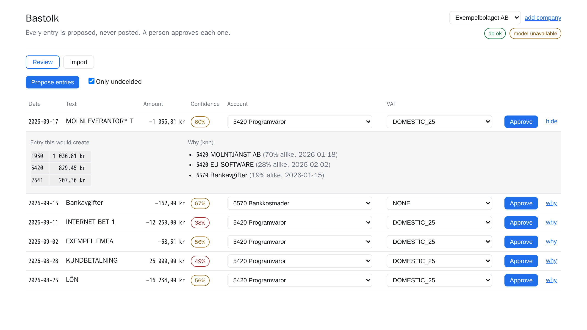
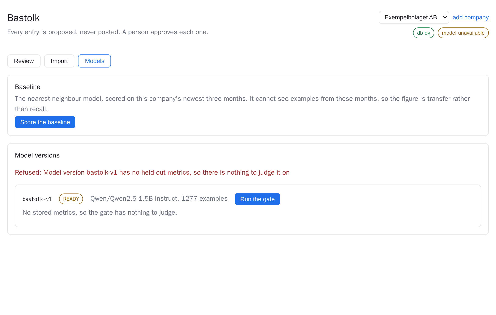

# Bastolk

Bastolk suggests a bookkeeping entry for each bank transaction. Suggestions
come from two local models — a small LLM fine-tuned on synthetic Swedish
transaction texts, and a nearest-neighbour model that learns one company's own
habits — and a person reviews every one of them. Approved entries leave the
tool as a SIE4 file that the real accounting system imports.

Nothing is posted anywhere automatically: the tool proposes, a human decides.

- **Design** (what it does and why): [docs/design.md](docs/design.md)
- **Architecture** (how it is built): [docs/architecture.md](docs/architecture.md)
- **Outstanding work**: [TODO.md](TODO.md)
- **Where the coding agent went wrong**: [docs/agent-log.md](docs/agent-log.md)



## Status

The whole path runs: import a SIE4 file, import a bank CSV, get a proposed
entry per transaction with the evidence behind it, approve or correct each
one, and download the approved entries as SIE4. Built in a two-day time box.

### What works

| | |
| --- | --- |
| SIE4 import | CP437 decoded, amounts read as integer ore, a verification that does not balance is rejected with its id named |
| Bank CSV import | CP1252 with a decimal comma, columns found by name, re-uploading an overlapping export adds only what is new |
| Nearest-neighbour model | pgvector search over the company's own past entries, with the matched entries shown as evidence |
| Rules | VAT split and reverse-charge lines built in code, never by a model. Balanced or it throws |
| Review and correction | A person decides every entry. A correction is stored as an example and changes the next proposal at once |
| SIE4 export | Written from journal entries, which exist only because someone approved them |
| Promotion gate | Reads stored metrics and refuses to compare figures from different splits |
| Tenancy | A guard resolves the company; a second company sees none of the first one's data |

### What is not here

- **No real bookkeeping history.** The SIE4 export from the real companies did
  not arrive during the build, so everything is exercised against a synthetic
  fixture and the real bank file. The consequence is in the results below and
  it is the main thing to fix next.
- **The fine-tuned model is trained but not served.** The training pipeline
  runs end to end and produces a merged model, but Ollama 0.34.2 refuses to
  import `Qwen2ForCausalLM` from safetensors (`unsupported MLX architecture`),
  so the model has to be converted to GGUF first and that needs llama.cpp's
  converter. Until a version is served, the LLM predictor reports itself
  unavailable and the composite falls through to the baseline, which is the
  designed behaviour while the GPU is busy and is exercised here for real.
- **No background job queue.** Training is started by hand rather than from
  BullMQ. It was second on the cut list and the cut was taken.
- **The frontend's response types are hand-mirrored** for the endpoints that
  return computed views. Path and request types are generated from the API's
  OpenAPI document; the view types are not, so those two can still drift.

## Results

Read the caveat before the numbers.

**There is no real-history accuracy figure, and the honest reason is that
there is no real history.** The interesting number in this project was always
the gap between synthetic validation accuracy and accuracy on real Swedish
bank lines. Measuring it needs labelled real entries, which come from the SIE4
export. Without that file the only real data available is the bank statement,
which has no labels on it. Reporting a synthetic-on-synthetic score as though
it meant something would be exactly the dishonesty the design set out to
avoid.

What can be reported is the fine-tuned model measured against synthetic data
it never trained on. This is the optimistic number: the validation slice comes
from the same generator as the training set, so it shares its vocabulary and
its habits. Real bank text will be harder.

| | Qwen2.5-1.5B-Instruct, LoRA, 3 epochs |
| --- | --- |
| Account correct | 39.2% |
| VAT treatment correct | 74.1% |
| Both correct | 37.8% |
| Answers that did not parse | 0 |
| Held-out examples behind those figures | 143 |
| Training examples | 1277, over 31 account and VAT labels, smallest label 22 |
| Real bank transactions coded end to end | 73 |

Reading those numbers:

- **The format was learned completely and the task was not.** Not one of the
  143 answers failed to parse, so the model reliably produces the small JSON
  object it was trained to produce. Choosing the right account out of 31 is a
  different problem, and 39% is weak.
- **VAT is much easier than the account**, which is what you would expect: the
  treatment follows mostly from whether the supplier reads as Swedish or
  foreign, and that is visible in the text. The account needs to know what the
  supplier actually sells.
- **1277 examples is small.** The design called for a few thousand and two
  generation rounds produced this after deduplication and two discarded
  batches. More data is the first thing to try before anything clever.
- **No baseline sits beside this figure**, because the baseline searches a
  company's real history and there is none. That makes this an unanchored
  number, and it should not be quoted without saying so.



### The evaluation is built and honest, even with nothing to measure

`POST /models/evaluate` scores a predictor on the newest three months of
imported history and passes the cutoff down to the predictor, so the
nearest-neighbour model cannot search examples from the test months. Run
against the synthetic fixture it returns 0%, which is correct: the fixture's
four verifications all fall inside the held-out window, so the filter leaves
the model nothing to match against. Without that filter it would have returned
100% by finding its own stored answers, and that is the number this guard
exists to prevent anyone from reporting.

An end-to-end test pins the behaviour rather than the number, asserting that no
neighbour returned under a cutoff is dated on or after it.

The promotion gate refuses `bastolk-v1` for the same kind of reason: it has no
held-out metrics, only synthetic ones, and promoting on a synthetic figure is
the leak the split exists to prevent. That refusal is what the screenshot
above shows.

## What I would do next, in order

1. **Import the real SIE4 history.** It supplies the labels, the baseline's
   examples and the test months, and it is the one input everything else is
   waiting on. Every other item is smaller than this one.
2. **Report the synthetic-to-real gap** with the baseline beside the
   fine-tuned model, per account, with the number of examples behind each
   figure.
3. **Move training behind the job queue** so the API reports progress and the
   GPU is released and reclaimed around each run.
4. **Calibrate confidence.** Both models emit a score, neither is calibrated,
   and the review screen currently shows the raw number rather than a measured
   hit rate per band.
5. **Generate a larger and more varied dataset.** Two rounds produced 1420
   usable examples; two batches had to be discarded after reading them,
   which is a generator problem rather than a volume problem.
6. **Distinguish the two reverse-charge treatments.** They book identical VAT
   accounts, so label extraction cannot tell them apart from a verification
   alone and reports the EU one.

## Stack

NestJS + Prisma + PostgreSQL (pgvector) + BullMQ/Redis on the backend, React +
Vite on the frontend, one pnpm workspace. The fine-tuned model is trained with
QLoRA in Python and served by Ollama over local HTTP. Everything runs locally:
no bookkeeping data leaves the machine.

## Running it

Everything runs in Docker, with the dev container as the place you work from.

```bash
docker compose up -d --build dev     # dev box + postgres + redis + ollama
ssh dev@localhost -p 2240            # or open the folder in Zed / VS Code
```

Inside the container:

```bash
pnpm install                         # workspace dependencies
pnpm --filter api prisma migrate dev # database schema
pnpm dev                             # API on :3000, web on :5173
```

Setup, GPU notes and troubleshooting: [.devcontainer/README.md](.devcontainer/README.md).

## Data

`data/` is gitignored. Real SIE4 exports, bank CSVs, generated datasets and
model weights stay out of the repository; the tests use a small synthetic SIE
file that is committed.

## Licence

MIT — see [LICENSE](LICENSE).
