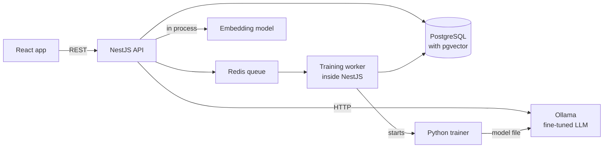
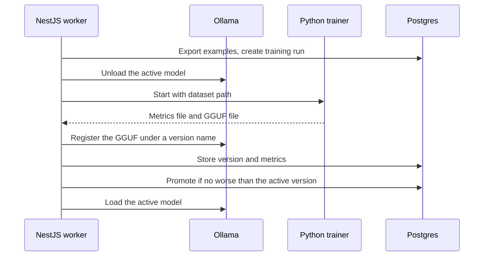

# Bastolk — architecture

## Overview

One NestJS application owns all business logic and all data. Everything else is a supporting process that it calls: a database, a queue, a model server and a training script. Keeping a single owner means there is one place to look for any rule, and it keeps the effort in the framework this project is practice for.



The React app only talks to the API. The API answers prediction requests from two sources: nearest-neighbour search in Postgres, and the fine-tuned model served by Ollama. Training is a queued job. The worker writes a dataset to disk, starts the Python script, reads back its metrics, and registers the new model version.

Three properties follow from this shape.

- **The LLM is optional at runtime.** If Ollama is down, or busy because training holds the GPU, suggestions still come from nearest-neighbour search.
- **Python never touches the database.** It receives files and returns files. That keeps the training script small, and replaceable by a different training method later.
- **No bookkeeping data leaves the machine.** Bookkeeping data, embeddings and model weights are all local. A hosted model is used offline to write synthetic training texts, and it never sees real entries.

## Dependencies

Choices follow two rules: match the target stack (TypeScript, NestJS, PostgreSQL, React) where there is one, and otherwise take the most conventional option, because debugging an unusual setup is time this project does not have.

### Backend and data

| Dependency | Role | Why this one | Rejected, and why |
| --- | --- | --- | --- |
| NestJS | API framework | It is the target stack's framework and the main learning goal. Its opinionated structure (modules, dependency injection, decorators) is exactly what needs practice. | Plain Express or Fastify. Already familiar, so it would teach nothing. |
| PostgreSQL with the pgvector extension | All persistent data, plus nearest-neighbour search | Postgres is the target stack's database. pgvector turns similarity search into an ordinary SQL query, so no second data store is needed for a few thousand rows. | A dedicated vector database. One more service to run for no benefit at this size. |
| Prisma | ORM and migrations | The whole schema lives in one readable file, which helps both a human and a coding agent hold it in mind. The generated client is fully typed. The cost is that the vector column needs raw SQL. | TypeORM. It is the ORM most Nest tutorials use, but its types are weaker and its runtime behaviour is more surprising. |
| class-validator with a global validation pipe | Request validation | It is the Nest convention. DTO classes validate input and also generate the API schema, so one definition serves both. | Zod. Arguably nicer, but the goal is to learn the mainstream Nest path first. |
| Nest's Swagger module with openapi-typescript | API contract and frontend types | Types for the React app are generated from the backend's DTOs, so the two cannot drift apart. The Swagger page also makes a handy demo tool. | A hand-written shared types package. It drifts, and it has to be maintained. |
| BullMQ with Redis | Background jobs | Training takes minutes and must not block a request. Nest has first-class BullMQ support, and queues are central to any backend that processes documents. | pg-boss, which needs no Redis. Less conventional in Nest, so less useful as practice. This whole item is second on the cut list. |
| Vitest with Supertest | Unit and end-to-end tests | It is what the Nest CLI scaffolds, as `vitest.config.ts` plus a separate `vitest.config.e2e.ts`, and Nest's testing module works on top of it unchanged. **Corrected 2026-09-20:** this row first named Jest, on the grounds that the scaffold generates it and that Vitest would need extra configuration for decorator metadata. Nest CLI 12 generates Vitest already configured, together with oxlint in place of ESLint and `"type": "module"`. | Jest. Restoring it would mean replacing the generated configs and working against the generator on every later `nest g`. |

### Models

| Dependency | Role | Why this one | Rejected, and why |
| --- | --- | --- | --- |
| transformers.js with a small multilingual embedding model | Embeddings for nearest-neighbour search, computed inside the Node process on the CPU | It keeps the baseline model entirely in TypeScript. Running on the CPU means it never competes with the LLM or with training for the 8 GB of VRAM. | Embeddings from Ollama. Simpler to call, but they would occupy the GPU that training needs. |
| PEFT with the transformers Trainer | Fine-tuning | LoRA adapters are all that train, which is what keeps a 1.5B model inside 8 GB alongside everything else on the card. **Corrected 2026-09-20:** this row first named Unsloth for its memory savings and its GGUF export. The memory savings are not needed at this size. The GGUF export is: Ollama 0.34.2 rejects `Qwen2ForCausalLM` from safetensors, so a merged model still has to be converted before it can be served, and that conversion is the one step this toolchain does not yet do. | Unsloth. It is a wrapper over the same libraries, and adopting it inside a time box would have added an install to debug before anything could train. It is the obvious thing to reconsider when the conversion step is built. |
| A 2B-class instruct model, with a sub-1B model for the toy run | Base model | It must leave VRAM headroom during QLoRA, handle Swedish text, and be on Unsloth's supported list. The current Qwen small models fit all three. The choice is cheap to change, since only a model name differs. | 7B-class models. They fit in 4-bit, but training is slower and the task is too simple to need them. |
| [Ollama](https://pkg.go.dev/github.com/ollama/ollama/api) | Serving the fine-tuned model over local HTTP | It loads a GGUF file with one command and unloads it on request, which frees the GPU before training. Its native chat endpoint returns token log-probabilities, which the confidence score is built on. | llama.cpp's own server. It offers more control and stays as the fallback. Note that Ollama's OpenAI-compatible endpoint [has been reported](https://github.com/ollama/ollama/issues/16117) to drop log-probabilities, so the native endpoint is the one to call. |
| A large hosted model, called through its API | Writing the synthetic training set, once per dataset version | Varied, realistic Swedish bank texts that fit a given BAS account need a strong model. It runs offline from the product, so it adds no runtime dependency and no cost per suggestion. | Generating with a local 7B model. It is slower, weaker on Swedish bookkeeping, and would occupy the GPU. |

### Frontend and tooling

| Dependency | Role | Why this one | Rejected, and why |
| --- | --- | --- | --- |
| React with Vite | Frontend | React is the target stack's frontend. Vite is the lightest way to run it. | Next.js. Server rendering adds nothing to a local tool. |
| TanStack Query | Server state in the frontend | Approving a row must refresh the list and the counters, and its cache invalidation does this in a few lines. | Hand-rolled fetch and state. More code, and more bugs. |
| pnpm workspaces | One repository for API, web and training code | One CI pipeline, one CLAUDE.md, and the agent sees the whole system at once. | Nx or Turborepo. Their build caching pays off in large repos, not in a weekend project. |
| Docker Compose | Runs everything: the dev box, Postgres, Redis and Ollama | A single command gives the whole stack, and the GPU reaches the containers. **Corrected 2026-09-19:** this row first said that Ollama and training would run natively on Windows, because GPU passthrough looked like the fragile part. It is not: `gpus: all` on the Docker Desktop WSL2 backend is one line, and it was verified before any code was written — `torch.cuda.is_available()` is true on PyTorch 2.14+cu130 with a real matmul on the RTX 3070, and Ollama reports `library=CUDA compute=8.6`. See [../.devcontainer/README.md](../.devcontainer/README.md). | Splitting the stack across host and containers. It costs a second toolchain on Windows and a second set of paths, and buys nothing once the GPU works in the container. |
| GitHub Actions | CI | Free, and the most widely recognised. | No CI at all. Tempting for a weekend, but a green pipeline is part of showing how the work was done. |

Tooling facts were checked on 19 September 2026 against the linked pages.

## NestJS modules

Modules are divided by business capability, not by technical layer, and each one is chosen so that it exercises a Nest concept worth knowing. A module per capability is how Nest codebases grow in practice: a team can own a folder, and dependencies between capabilities are visible in the imports.

| Module | Responsibility | Nest concept it exercises | Why the boundary is here |
| --- | --- | --- | --- |
| `companies` | The list of companies, and the guard that scopes every request to one of them | Guards, custom parameter decorators, request-scoped context | Tenancy is a cross-cutting rule. Putting it in a guard means no controller can forget it. |
| `sie` | Parsing SIE4 files, importing them, exporting approved entries | File upload handling, pure functions wrapped in a provider | The parser is plain TypeScript with no Nest imports, so it is trivially testable. The module only adapts it to HTTP and the database. |
| `ledger` | Accounts and historical verifications | A plain CRUD module: controller, service, DTOs | It is the reference example of the basic Nest pattern, and the first thing built. |
| `bank` | Bank CSV import and the transactions to be coded | Pipes for parsing and validating uploaded content | Bank formats vary by bank. Isolating them keeps format quirks away from the rest. |
| `predictors` | The prediction interface and its two implementations | Custom providers, injection tokens, factory providers | This is the clearest use of dependency injection in the project. The rest of the code asks for "a predictor" and never learns which one it got. |
| `rules` | Turning an account and a VAT treatment into balanced journal lines, plus checks | Nothing Nest-specific, by design | Accounting rules must be testable without starting a framework. It is a module only so others can import it. |
| `suggestions` | Orchestration: predict, apply rules, store, approve, correct | Services composed from other modules, transactions, an exception filter for domain errors | This is where the use cases live. Keeping it thin shows that the other modules have the right shape. |
| `training` | Dataset export, the training job, the model registry and the promotion gate | Queue producers and processors, child processes, lifecycle hooks | It is long-running and failure-prone, and it needs different error handling from request code. |
| `common` | Configuration, the database client, a logging interceptor, health checks | Global modules, interceptors, validated configuration | Shared infrastructure sits in one place, so feature modules contain only features. |

### The predictor interface

Both models implement one small interface: given a transaction and a company, return ranked candidates, each with an account, a VAT treatment, a confidence between 0 and 1, and evidence. Evidence is either the matched past entries or the model version that answered.

A composite predictor sits in front of the two. It asks nearest-neighbour first and accepts the answer when the best match is close, because a supplier the company has booked before should be booked the same way again. Otherwise it asks the LLM. It falls back to nearest-neighbour's best guess when the LLM is unavailable or names an account that is not in the company's chart, and it records which predictor answered. The strategy and the closeness threshold are configuration, not code, which is what makes a side-by-side comparison of the two models a one-line change.

## Data model

The schema separates three kinds of fact that are easy to blur: what was booked in the past, what the tool proposed, and what a person decided. Keeping them apart is what makes evaluation and retraining honest, because a model must never be trained on its own unreviewed output.

| Table | Holds | Why it exists as its own table |
| --- | --- | --- |
| `company` | One row per legal entity | Every other table references it. It is the tenancy boundary. |
| `account` | The chart of accounts per company, from the SIE file | Predictions are validated against it. An account number that is not in the chart is rejected, whatever the model says. |
| `verification` and `verification_line` | Historical journal entries, as imported | This is the ground truth. It is kept exactly as imported, so that label extraction can be re-run when its rules improve. |
| `bank_transaction` | Rows from uploaded bank files | They are the inputs to be coded. A hash of date, amount and text prevents importing the same row twice. |
| `training_example` | One row per labelled text: the text, amount, account, VAT treatment, source, date and embedding vector | Nearest-neighbour searches this table, and the corrections in it also join the LLM's training set. The source is either "history" or "correction", so the effect of corrections can be measured separately. Synthetic examples are files on disk, not rows, because they belong to no company. |
| `suggestion` | What the tool proposed for a transaction: candidates, chosen predictor, model version, confidence, evidence | Proposals are kept even after a correction. Comparing proposals with final decisions is how real-world accuracy is measured over time. |
| `decision` | What the person approved: final account, final VAT treatment, whether it differed from the suggestion | It is the audit trail, and the source of new training examples. |
| `journal_entry` and `journal_line` | The balanced entry built by the rules module from a decision | This is the export. It is derived data, but storing it means an export always matches what was shown on screen. |
| `model_version` | One row per trained model: base model, dataset size, held-out metrics, file path, status | It is the registry that the promotion gate reads and writes. The model is shared between companies, so exactly one version is active, and its metrics are stored per company. |
| `training_run` | One row per job: status, timings, log tail, the resulting version | Training fails in many ways. A visible history of runs is the difference between debugging and guessing. |

### Conventions

- **Money is stored as integer öre.** Floating-point amounts eventually produce entries that fail to balance by one öre, and a balance check that sometimes fails for no real reason is worse than none.
- **Every table that holds company data has a company id, and every query filters on it.** The guard supplies the id, and services never accept it from the request body.
- **Imported history is never edited.** Corrections and decisions are new rows. This mirrors how bookkeeping itself works, where errors are corrected with new entries, not by changing old ones.
- **Embeddings live next to the text they describe.** A correction becomes searchable the moment its row is inserted, which is why the nearest-neighbour model needs no training step.

## Model pipeline

The LLM is trained on generated examples and judged on real ones. Each step below exists to keep that judgement honest, and to make sure a retrained model is used only if it is no worse than the current one.

### Synthetic training data

A generator command in the API builds the dataset from a small taxonomy file. The taxonomy lists the 30 to 40 BAS accounts a small company actually uses, the VAT treatments that are valid for each, and typical purchase scenarios per account.

- **The label comes first, the text second.** For each account, VAT treatment and scenario, the hosted model is asked to write bank texts that would be booked that way. Asking a model to label random texts would import its mistakes as ground truth. Conditioning on the label makes wrong labels rare.
- **Real format patterns are the style guide.** The prompt includes anonymised patterns from real bank files: upper case, truncation, card prefixes, city suffixes, reference codes. Without them a generator writes tidy descriptions that no bank ever produced.
- **Class balance is chosen, not inherited.** Common accounts get more examples than rare ones, as in real life, but every account gets a floor of examples so the model can learn it at all.
- **Near-duplicates are removed, and a slice is held out as synthetic validation data.** Validation data drives early stopping. Real data is never used for that, so the real test set stays clean.
- **A sample of 50 is read by hand before any training.** Ten minutes of reading catches a systematic generator error that would otherwise cost a full training run to discover.

The generator is TypeScript, not Python. It shares the text normalisation and the chat format with the rest of the API, so training and serving cannot drift apart.

### From verifications to labels

Real history feeds the nearest-neighbour model and provides the test labels for the LLM. A verification is several lines, not one label. A typical purchase has a bank line, a VAT line and an expense line. The label is derived by rule:

- **Account:** the single line that is neither a bank account nor a VAT account.
- **VAT treatment:** inferred from which VAT accounts appear in the verification. The treatments are a small fixed set: domestic at 25, 12 or 6 percent, reverse charge within the EU, reverse charge outside the EU, and no VAT.
- **Excluded:** verifications with more than one non-bank, non-VAT line, such as salaries and year-end entries. They are not what a bank transaction looks like, and they would teach the model noise.

Which account numbers count as bank and VAT accounts is configuration per company, seeded from the standard BAS ranges. The same configuration drives the rules module in the other direction, so an entry built from a prediction has the same shape as the entries the company's history already contains.

### What the LLM sees and produces

The input is a short chat message with the transaction text, the amount, and whether money went in or out. The output is one small JSON object with an account number and a VAT treatment, and nothing else.

- **The chart of accounts is not in the prompt.** The model learns the standard BAS accounts from the synthetic examples, and accounts a company has added itself are left to nearest-neighbour. A chart in every prompt would multiply the training time and teach the model to copy from a list.
- **No explanation is generated.** A 2B model's explanations are fluent and unreliable. The evidence shown to the user comes from nearest-neighbour matches, which are real past entries.
- **Output is constrained to the JSON schema at serving time.** This removes a whole class of parsing failures. The account number is still checked against the chart afterwards.

### Confidence

For the LLM, confidence is the product of the probabilities of the account-number tokens, read from the log-probabilities Ollama returns. For nearest-neighbour, it is the share of similarity-weighted votes won by the top account. The two scales are not comparable out of the box. Both are therefore calibrated against the held-out months: for each confidence band, how often was the prediction right? The review screen shows that measured hit rate, not the raw score.

### Training

- **LoRA adapters, with 4-bit quantisation available but not used.** Only the adapter matrices train, which is what keeps the run inside 8 GB. **Corrected 2026-09-20:** this said QLoRA on a 4-bit base model. `bitsandbytes` 0.50.2 was verified working against the cu130 torch build, so 4-bit is available behind `--load-4bit`, but a 1.5B model in bfloat16 fits without it and quantising a model that already fits only costs accuracy.
- **Loss on the answer only.** The prompt tokens are masked out, so the model is graded on the account and VAT treatment, not on reproducing the transaction text.
- **Few epochs, with early stopping on the synthetic validation slice.** With a few thousand short examples, overfitting arrives fast, and the validation curve is the only reliable signal.
- **Real data in two parts, split by date.** Older months are the development set, looked at while tuning the generator and the training settings. The newest three months are the test set. Accuracy on synthetic validation data is reported beside the real figure, because the gap between them is the most informative number in the project.
- **Retraining starts from the base model, not from the previous adapter.** Stacking fine-tunes on small batches of corrections drifts and forgets. A full retrain on the synthetic set plus all corrections takes minutes, so nothing is gained by being incremental.
- **Corrections are weighted up.** A few dozen corrections would vanish among thousands of synthetic rows, so each is repeated several times in the training file. Corrections dated inside the test months are left out.

### Serving and versions



The worker unloads the served model before training because 8 GB cannot hold both. While the GPU is busy, suggestions come from nearest-neighbour search, and the API reports that state so the frontend can show it.

Each version is a merged, quantised GGUF file of about 1.5 GB, registered in Ollama under a name that includes a version number. Whole merged files are simpler to reason about than a base model with swappable adapters, and disk space is not a constraint. Rolling back is a status change in one table row.

## Repository layout

One repository holds the API, the frontend and the training code, because they change together and a coding agent works best when it can see all of them.

```text
bastolk/
  CLAUDE.md                 conventions, commands, and rules for the agent
  README.md                 what it is, how to run it, results
  docker-compose.yml        Postgres with pgvector, Redis
  pnpm-workspace.yaml
  .github/workflows/ci.yml
  docs/
    agent-log.md            where the agent went wrong, and what caught it
  apps/
    api/
      prisma/
        schema.prisma       the whole data model in one file
        migrations/
      src/
        main.ts             bootstrap: validation pipe, Swagger, filters
        app.module.ts
        common/             config, database client, interceptor, health
        companies/          entity, guard, decorator
        sie/
          parser/           pure TypeScript, no Nest imports
          sie.service.ts
          sie.controller.ts
        ledger/
        bank/
        predictors/
          predictor.interface.ts
          knn.predictor.ts
          llm.predictor.ts
          composite.predictor.ts
        rules/              pure TypeScript, no Nest imports
        suggestions/
        training/
          taxonomy.json     accounts, VAT treatments and scenarios to generate
          generate-dataset.command.ts
          training.processor.ts
          model-registry.service.ts
      test/                 end-to-end tests against a real database
    web/
      src/
        api/                generated types and the query hooks
        pages/              Review, Models, Import
        components/
  ml/
    train.py                the only Python file that matters
    evaluate.py             scores a model on a dataset file
    environment.yml
  data/                     ignored by git: SIE files, seed patterns,
                            synthetic datasets, model files
```

Three details of this layout carry intent.

- **Feature folders contain their own controller, service, DTOs and unit tests.** Everything about one capability is in one place, which is the Nest convention and also what a new team member expects.
- **The parser and the rules have no framework imports.** They are the parts most likely to be wrong in ways that matter, so they are the parts that must be fastest to test.
- **The data folder is ignored by git.** Real bookkeeping data and model weights must never reach a public repository. Tests use a small synthetic SIE file that is committed.

## CI and deployment

There is continuous integration and deliberately no continuous deployment. The model needs the local GPU and the data is private, so there is nowhere sensible to deploy to. CI still earns its place. When an agent writes much of the code, an automatic gate that does not depend on anyone's attention is the main quality control.

### What CI runs

One GitHub Actions workflow runs on every push, in this order, stopping at the first failure:

1. **Install with a frozen lockfile.** It proves the build is reproducible.
2. **Lint and type-check the API and the frontend.** These are the cheapest checks, and they catch the most common agent mistakes.
3. **Unit tests.** The SIE parser, label extraction and the rules module carry most of the weight here, because they hold the logic where a bug means wrong bookkeeping.
4. **End-to-end tests against a Postgres service container.** Migrations run from scratch, a synthetic SIE file is imported, and a suggestion round-trip is checked. The LLM predictor is replaced by a stub, since CI has no GPU. This is dependency injection paying for itself.
5. **Check that the generated API types are up to date.** The job regenerates them and fails on any difference, so the frontend can never silently fall behind the backend.
6. **Build both apps.**

Model quality is not tested in CI. It is measured by the training job, stored with each model version, and enforced by the promotion gate. Code correctness and model quality are different questions, and each has its own gate.

### How this would run on GCP

This is not built, but it is worth being able to sketch, since GCP is the target platform.

- **API:** a container on Cloud Run, which suits a stateless NestJS service and scales to zero.
- **Database:** Cloud SQL for PostgreSQL, which supports the pgvector extension.
- **Queue:** Memorystore for Redis, or Cloud Tasks if the queue were only used for training jobs.
- **Frontend:** static files from a storage bucket behind a CDN.
- **Model serving:** the real decision. Options are a GPU-backed Cloud Run service or a small GPU instance for a self-hosted model, or replacing the local model with a hosted one. The trade-off is fixed cost, latency and data residency against accuracy and simplicity.
- **Training:** a batch job on a GPU instance that starts on demand, reads a dataset from a bucket, and writes the model file back.
- **Delivery:** the same workflow would build an image, push it to Artifact Registry, run migrations as a separate step, and deploy to Cloud Run on merges to main.
